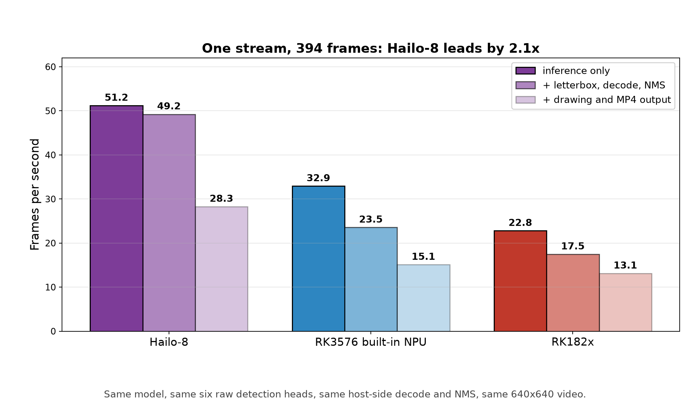

# Single-stream and multi-stream inference on an RK3576: built-in NPU vs two M.2 accelerators

The RK3576 has a 6 TOPS NPU on the die and one M.2 slot for an external accelerator. I ran the
**same YOLO26n** on three of them - the built-in NPU, an RK182x module and a Hailo-8 module -
first one stream at a time, then many streams at once, to see where each one belongs.

## Three architectures, three ways to parallelise

| Accelerator | How it goes parallel | Inference API used here |
|---|---|---|
| RK3576 built-in NPU | 2 NPU cores, one stream per core | rknn-toolkit-lite2, one frame per call |
| RK182x (M.2) | 8 NPU cores, one stream per core | rknn3lite, one frame per call |
| Hailo-8 (M.2) | one device, no user-visible core split; internal pipeline | `InferModel` via `run_async`, 4-8 inferences in flight |

So the Rockchip parts were driven **one process and one core per stream**, while Hailo-8 was driven
as **N streams funnelled into one device**. Both report the same metric: **aggregate frames per
second while N streams are being served**. Forcing Hailo-8 into the Rockchip core model would have
measured an API mismatch, not the silicon.

## Measurement conditions

- Model: `yolo26n`, 80 COCO classes, 640x640, INT8. All three graphs stop at the **same six raw
  one2one detection heads**, and decode/NMS run in **one shared host implementation**
  (`common/postprocess_common.py` + `common/postprocess_yolo26.py`); the letterboxed input is
  byte-identical across the three runs (same clip sha256 in every record).
- Hailo-8 runs **Hailo's official prebuilt HEF** through Hailo's documented throughput path
  (`create_infer_model()` -> `configure()` -> `run_async()` with four inferences in flight, the
  same pattern `hailortcli run` uses internally); RK182x uses **Rockchip's official quantization
  recipe** (w8a8 with w16a16 score-branch subgraphs); the RK3576 model was converted with the same
  graph boundary (rknn-toolkit2 2.3.2).
- Video: 3840x2160 source, 394 frames. There is no hardware decoder in this environment (software
  4K decode costs 60.7 ms/frame), so a 640x640 derivative of the same clip was used for the
  accelerator comparison: 2.1 ms/frame.
- Multi-stream runs decode a video and run inference per stream; **drawing and video encoding are
  excluded** - that is host CPU work and is reported separately.

## One stream: Hailo-8 leads

| Accelerator | inference only | + letterbox, decode, NMS | + drawing and MP4 output |
|---|---:|---:|---:|
| Hailo-8 (4 inferences in flight) | **51.2 FPS** | **49.2 FPS** | 28.3 FPS |
| RK3576 built-in NPU | 32.9 FPS | 23.5 FPS | 15.1 FPS |
| RK182x | 22.8 FPS | 17.5 FPS | 13.1 FPS |

Full 394-frame clip, identical pipeline. The "inference only" and "end-to-end" columns mean the
same thing on all three platforms; the middle column (`pipeline_without_io`) does not - it includes
the frame read and letterbox for Hailo-8 and excludes them for the two Rockchip parts, which record
them separately (`read_letterbox_infer_decode`, i.e. 21.7 FPS and 15.9 FPS like for like).
**Hailo-8's pipeline throughput is 2.1x the built-in NPU's**, its device service rate of 51.2 FPS is 97% of the 52.5 FPS Hailo's own CLI reports for
this HEF, and its hardware latency is 13.9 ms per inference against roughly 30 ms and 44 ms for
the other two. The "inference only" column is each runner's own measurement of the accelerator
call: for Hailo-8 the rate the device serves while its pipeline stays full, for the two Rockchip
parts the per-call time over all 394 frames.

*Frame 200 of each run, left to right: Hailo-8, the RK3576 built-in NPU, RK182x. The strip in the
corner is drawn by the run itself - the accelerator's single-stream rate and the rate that pass
sustained; which JSON field each figure comes from is tabulated in `results/README.md`. The RK182x
panel was re-rendered from that run's own recorded per-frame detections after the module had been
swapped out of the slot, so its boxes and confidences are the run's but its pixels came from the
record. All three strips were verified pixel by pixel with `common/check_osd_figure.py`, against
every one-character variant of themselves.*

## Many streams: Hailo-8 serves all of them at its own ceiling, but does not grow

| Concurrent streams | Hailo-8 (one device) | RK3576 built-in NPU (2 cores) | RK182x (8 cores) | RK182x / NPU |
|---:|---:|---:|---:|---:|
| 1 | 50.3 | **21.2** | 16.2 | 0.76x |
| 2 | 51.3 | **43.2** | 34.4 | 0.80x |
| 4 | 51.6 | 52.3 | 57.0 | 1.09x |
| **8** | 51.6 | 69.7 | **88.6** | **1.27x** |

- **Hailo-8 is flat**: 1 stream or 8 streams, the total stays at 50-52 FPS and each stream gets
  1/N of it (6.5 FPS each at 8 streams). Where it is flat is the device's own ceiling - the same
  8-stream run with the host decode removed measures 52.2 FPS. It is a fixed-throughput device:
  opened exclusively (Hailo's own CLI is refused a second process), no user-visible cores, and no
  growth with stream count. To add throughput, add modules.
- **The built-in NPU does not stop at its core count**: with two NPU cores on this SoC, one stream
  per core is the most efficient operating point (21 -> 43 FPS), and past that the streams share
  the two cores: the aggregate keeps rising (52 -> 70 FPS) and passes Hailo-8 at 8 streams
  (69.7 against 51.6).
- **RK182x scales to 88.6 FPS across 8 cores**, 1.7x Hailo-8 - but only **1.27x the built-in
  NPU**. An earlier version of this table set RK182x's 8-stream figure against the NPU's 3-stream
  point and reported 1.8x; the NPU curve had simply not been measured past 3 streams (the
  benchmark's `--instances` default was `1,2,3`). The missing points are now measured.

## What that means

| Use case | Choice | Why |
|---|---|---|
| One camera / one stream | **Hailo-8** | 49.2 vs 23.5 FPS, and the lowest single-frame latency at 13.9 ms |
| One stream without a module | built-in NPU | 23.5 FPS, free, no module |
| **Multi-camera, 4+ streams** | RK182x (88.6 FPS at 8) or the built-in NPU (69.7 at 8) | RK182x leads by 1.27x at 8 streams and is level at 4; the NPU is free but occupies the SoC |
| The board also runs other models | Hailo-8 (single stream) or RK182x (many streams) | both keep the compute in the module, leaving the SoC's NPU free |

**RK182x's value needs restating**: at 1-2 streams it is *slower* than the built-in NPU
(16.2 / 34.4 against 21.2 / 43.2, the PCIe round trip per inference), at 4 streams it is level,
and at 8 streams it leads by 1.27x. What it does buy uniquely is **compute that is not on the
SoC**: with the module in the slot the RK3576's NPU stays free for other models, which is what
matters when the board is doing more than one job.

**Hailo-8's value is the single stream**: it drives its device to its full 51.2 FPS at the lowest
latency, and it keeps the work off the SoC's NPU.

## Notes

1. Single-stream figures are the last of several identical runs; each multi-stream point was
   measured once.
2. Multi-stream runs exclude drawing and encoding; eight annotated output videos would make the
   host CPU the bottleneck first (already visible on one stream: adding drawing and MP4 writing
   takes 49.2 FPS down to 28.3).
3. No hardware decoder here, so the 4K source tops out at 16.5 FPS; a real deployment should use
   the RK3576's VPU.
4. This board's PCIe link is **Gen2 x1** while the Hailo-8 module supports Gen3 x4, so Hailo's
   published 155 FPS is not reachable here - Hailo's own official HEF measures 52.5 FPS.
5. The Rockchip runtimes are driven one frame per call, which is what their Python bindings expose
   (RKNN3 1.0.4 has no `rknn3_run_async`, and rknnlite does not surface a split run/wait pair);
   their multi-stream figures therefore come from one process and one core per stream.
6. The two published comparison videos are in `results/clips/` (single stream and 8 streams); the
   per-device annotated clips are not shipped. Each device's frame-200 screenshot and the
   pixel-level verification record for all three (`results/single_stream/frame200_check.json`) ship
   with the results.
7. Every figure is generated from the raw JSON by `common/make_final_figures.py` and
   `common/make_osd_figure.py`; the records, the field-by-field inventory and every edit made to
   the copied records (all of them description or naming fields, none of them measured values) are
   documented in `results/README.md`.