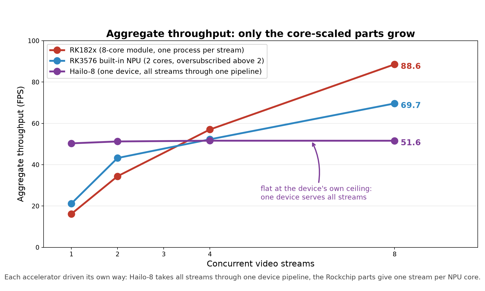

# RK3576 三种加速器实测：YOLO26n 单路与多路推理

测量日期：2026-09-20／21。模型：`yolo26n`（COCO 80 类，640×640，INT8）。
三端图边界一致（六个 one2one 原始检测头），解码/NMS 由**同一份主机实现**执行
（`common/postprocess_common.py` + `common/postprocess_yolo26.py`），输入逐字节一致
（三次运行用的测试视频 sha256 相同）。RK182x 与 Hailo-8 使用各自官方的量化配方与官方编译产物。

本报告的全部数字都来自 `results/` 下随本文件发布的 JSON 记录；图表由
`common/make_final_figures.py` 从同一批 JSON 生成；三张运行画面截图的横幅文字由
`common/check_osd_figure.py` 做像素级校验（校验记录见 `results/single_stream/frame200_check.json`）。

## 0. 三端的调用方式

三个平台暴露给 Python 的推理接口不同，各端都用**自己平台文档给出、能拿到的最好调用方式**：

| 加速器 | 接口 | 一次调用的帧数 | 并发的推理数 |
|---|---|---|---|
| Hailo-8 | HailoRT `InferModel`：`create_infer_model()` → `configure()` → `run_async()`/`wait()` | 1 | 4（单路）/ 8（多路） |
| RK3576 内置 NPU | `rknn-toolkit-lite2`（`rknnlite`） | 1 | 1 |
| RK182x | RKNN3 运行时（`rknn3lite`） | 1 | 1 |

多路测试按各平台的架构各自展开：RK3576 与 RK182x 把 NPU 核暴露给用户，因此**一路一进程、
一路一核**；Hailo-8 不暴露核划分、设备独占打开，因此 **N 路汇聚进同一个设备**（见第 2 节）。
三端报的是同一个指标——**同时服务 N 路时的总吞吐（aggregate FPS）**。

## 1. 视频源与解码开销

本环境没有可用的硬件解码器（缺 Rockchip MPP 的 GStreamer 插件、无 V4L2 解码节点），
4K 软解成为瓶颈，因此从同一段交通场景原片派生轻量源用于加速器对比
（解码开销记录：`results/derived_video_decode.json`）：

| 源 | 分辨率 | 解码 | 解码上限 |
|---|---|---:|---:|
| 原片 | 3840×2160（394 帧） | 60.7 ms/帧 | 16.5 FPS |
| **测试用（三端同文件）** | 640×640（394 帧） | 2.09 ms/帧 | 478 FPS |
| 中间派生 | 1920×1080（394 帧） | 9.11 ms/帧 | 110 FPS |

**真机应使用 RK3576 的 VPU 硬解**；这里的软解开销属主机侧限制，与加速器无关。

测试所用的 640×640 片段随本交付发布（`video/test.mp4`，394 帧 / 30 fps，
sha256 `30ec4406…`，与三份单路记录里的 `input.video_sha256` 一致）。

## 2. 单路推理（394 帧全片：读帧 → letterbox → 推理 → 解码/NMS）

| 加速器 | 配置 | 推理（设备侧） | 管道（+letterbox/解码/NMS） | 端到端（+画框+写视频） |
|---|---|---:|---:|---:|
| **Hailo-8（官方 HEF）** | 单设备，4 个推理在飞 | 19.5 ms → **51.2 FPS** | 20.3 ms → **49.2 FPS** | 35.4 ms → 28.3 FPS |
| **RK3576 内置 NPU** | 单模型（2 核 SoC） | 30.4 ms → 32.9 FPS | 42.5 ms → 23.5 FPS | 66.3 ms → 15.1 FPS |
| **RK182x** | 1 核 | 43.9 ms → 22.8 FPS | 57.3 ms → 17.5 FPS | 76.3 ms → 13.1 FPS |

> 中列 `pipeline_without_io` 在两端口径不同：Hailo-8 是"两个完成帧之间的间隔"，含读帧与
> letterbox；RK 两端是"RKNN 调用 + 解码/NMS"，读帧与 letterbox 记在
> `read_letterbox_infer_decode`（RK3576 46.11 ms → 21.7 FPS，RK182x 62.86 ms → 15.9 FPS）。
> 上表用的是各记录里发布的 `pipeline_without_io` 字段值。

单路结论：**Hailo-8 领先**（管道 49.2 FPS，是内置 NPU 的 2.1 倍）。
它的设备服务速率 51.2 FPS 已达 Hailo 官方 CLI 实测 52.5 FPS 的 97%（0.9745）——
在这条链路上，主机侧（letterbox+解码+NMS）不再是瓶颈，设备本身才是。

单路各层的分解（同一份 JSON，Hailo-8）：设备服务 19.5 ms → 加上读帧/letterbox/解码/NMS 为
20.3 ms（49.2 FPS）→ 再加画框与写 MP4 为 35.4 ms（28.3 FPS）。
**瓶颈从设备转移到了主机的画框与视频编码**（约 15 ms/帧），三端都有同样的现象。

### 三张运行画面

`results/figures/runtime_osd.png` 是 Hailo-8、RK3576 内置 NPU、RK182x 三份标注视频第 200 帧的
并排图（原图各存一份在 `results/single_stream/<设备>/frame200.png`）。左上角横幅由运行程序自己
绘制：设备名、模型名、设备侧速率与这一遍运行的实测速率。横幅文字经像素级比对确认，判据是
"期望文字必须胜过每一个错一位数字或错一个设备名的候选"。

### Hailo-8 官方标称 vs 本板实测

| 指标 | 官方 zoo | 本板实测 |
|---|---:|---:|
| yolo26n batch-1 FPS | 155 | **52.5**（`hailortcli benchmark`，Hailo 官方 HEF） |
| 本项目管线 | — | **51.2**（同一 HEF、同一条链路） |
| 单帧硬件延迟 | — | 13.89 ms |

**原因在平台**：本板 PCIe 链路跑在 **Gen2 x1（5.0 GT/s ×1）**，而模块本身支持
**Gen3 x4（8.0 GT/s ×4）**——只有其能力的 1/8。官方数字是在链路充裕的主机上测的。

## 3. 多路并发（每路独立解码 + 独立推理，RK3576 200 帧/路、RK182x 300 帧/路、Hailo 200 帧/路）



| 并发路数 | Hailo-8（单设备） | RK3576 内置 NPU（2 核） | RK182x（8 核） | RK182x / NPU |
|---:|---:|---:|---:|---:|
| 1 路 | 50.3 FPS | **21.2 FPS** | 16.2 FPS | 0.76× |
| 2 路 | 51.3 FPS | **43.2 FPS** | 34.4 FPS | 0.80× |
| 4 路 | 51.6 FPS | 52.3 FPS | 57.0 FPS | 1.09× |
| **8 路** | 51.6 FPS | 69.7 FPS | **88.6 FPS** | **1.27×** |
| 8 路（仅设备，不做主机解码） | 52.2 FPS | — | — | — |

**修订说明**：早期版本把 RK182x 的"8 路 88.6"与 RK3576 的"3 路 49.4"并列，得出"RK182x 是内置
NPU 的 1.8 倍"。原因是基准脚本 `--instances` 默认值只到 3：RK3576 只跑了 3 档，RK182x 跑了
`1,2,4,8`。用同一脚本补齐 4/8 路后（上表）：**8 路 RK182x 领先 1.27 倍，4 路 1.09 倍，
1–2 路内置 NPU 反而更快**。原 1/2/3 路数据保留在
`results/multi_stream/rk3576_multi_stream_1to3_runs.json`。

- **Hailo-8 的总量是平的**（50.3 → 51.6 FPS，与路数无关），而且它"平"的位置就是**设备自身的
  上限**（8 路 + 仅设备口径实测 52.2 FPS）。每路只能分到 1/N（8 路时每路 6.5 FPS）。
  设备不向用户暴露核划分、独占打开（连 Hailo 官方 CLI 开第二个进程都被拒：
  `HAILO_OUT_OF_PHYSICAL_DEVICES`）；设备单帧延迟 13.9 ms 意味着**单路**的理论下限约 72 FPS，
  实测流式吞吐 52 FPS 才是这台设备的实际能力。
  它是一台**固定吞吐设备**：把每路都服务到自己的满速，但不随路数增长。
- **RK3576 内置 NPU 并非"核数封顶"**：SoC 上是 **2 个 NPU 核**，1–2 路每路独占一核效率最高
  （21→43 FPS），4/8 路时多路共享 2 核（超订），聚合继续涨到 69.7 FPS，
  8 路时已经**超过 Hailo-8**。
- **RK182x 增长到 88.6 FPS**（8 核），是 Hailo-8 的 1.7 倍，但只比内置 NPU 高 **1.27 倍**。

**多路结论（同口径 aggregate throughput）：
RK182x 88.6 FPS > RK3576 内置 NPU 69.7 FPS > Hailo-8 51.6 FPS。**
要提高 Hailo 侧的总吞吐，Hailo 的方案是**增加模块**，而不是在一块模块上堆多路——
这与 RK 系列"一块模块内部分核扩展"的思路完全不同。

## 4. 结论：各加速器的适用场景

| 场景 | 选择 | 依据 |
|---|---|---|
| 单路 / 单相机 | **Hailo-8** | 管道 49.2 FPS（内置 NPU 23.5）；设备延迟 13.9 ms 最低；不占用 SoC 的 NPU |
| 单路但不想插模块 | 内置 NPU | 23.5 FPS，免费、无模块、无 PCIe 往返 |
| **多相机 / 4 路以上并发** | RK182x（8 路 88.6 FPS）或内置 NPU（8 路 69.7 FPS） | 高路数下 RK182x 领先 1.27 倍、4 路基本持平；内置 NPU 免费，但要占用 SoC 的 NPU |
| 还要在板子上跑别的模型 | Hailo-8（单路）或 RK182x（多路） | 两者的算力都在模块里，RK3576 的 NPU 可以留给别的任务 |

**RK182x 的价值需要重新界定**——它不是"内置 NPU 的 1.8 倍"。在本板本模型上：

- 1–2 路：**内置 NPU 更快**（21.2 / 43.2 对 16.2 / 34.4），因为 RK182x 每次推理要走 PCIe 往返；
- 4 路：基本持平（52.3 对 57.0，1.09 倍）；
- 8 路：领先 1.27 倍（69.7 对 88.6）；
- 它真正不可替代的地方是**算力不在 SoC 上**：用模块时 RK3576 的 NPU 可以留给别的模型。

**Hailo-8 的价值在单路**：设备侧 51.2 FPS、单帧 13.9 ms、主机管道 49.2 FPS，且不占 SoC 的 NPU。

## 5. 边界与未完成

1. **多路测试不含画框与编码**（刻意，测推理服务容量）。单路已可见画框+写 MP4 的代价
   （49.2 → 28.3 FPS）；真跑 8 路并输出 8 路标注视频，主机 CPU 会先成为瓶颈。
2. **4K 软解瓶颈**：本环境无硬解，4K 原片只有 16.5 FPS 上限；真机应走 VPU。
3. **Hailo-8 的 PCIe 链路只有 Gen2 x1**，是这块板对它的硬限制，官方 155 FPS 在此不可达。
4. **RK 两端每次调用一帧**（各自的 Python 绑定如此；RKNN3 1.0.4 没有 `rknn3_run_async`，
   rknnlite 也未暴露 run/wait 分离用法）。若要测更贴近硬件的上限，需要改用 C API，本轮未做。
5. **内置 NPU 的高路数超订只测到 8 路**：4/8 路共享 2 核的结果见上表，16 路以上未测。
6. **精度未做独立验证**：本轮比较的是速度与吞吐，三端共用同一份解码/NMS，但没有跑
   COCO 精度评估（`model/README.md` 说明了各模型的来源与图边界）。

## 6. 复现

四个入口脚本（板端）：

```bash
python3 Hailo/Hailo8/run_video_inference.py --hef model/Hailo/yolo26n_hailo8_official.hef \
    --video <clip.mp4> --out-dir out/hailo8 --depth 4
python3 rk3576/run_video_inference.py --model model/rk3576/yolo26n_rk3576_int8.rknn \
    --video <clip.mp4> --out-dir out/rk3576
python3 rk182x/rk1820/run_video_inference.py --model model/rk1820/yolo26n_rk1820_int8.rknn \
    --weight model/rk1820/yolo26n_rk1820_int8.weight --video <clip.mp4> --out-dir out/rk1820
python3 common/run_video_streams_benchmark.py --backend rk3576 \
    --model model/rk3576/yolo26n_rk3576_int8.rknn --video <clip.mp4> --instances 1,2,4,8 --frames 200
# RK182x 那一次记录用的是 --frames 300，见 results/README.md
```

图表与校验（主机）：`python3 common/make_final_figures.py`、`python3 common/make_osd_figure.py`、
`python3 common/check_osd_figure.py`。每个 runner 会在输出目录写 `video_result.json`
（逐帧检测 + 各层耗时）与 `annotated.mp4`。运行环境版本见 `docs/ENVIRONMENT.md`，
记录中每个文件与字段的说明见 `results/README.md`。