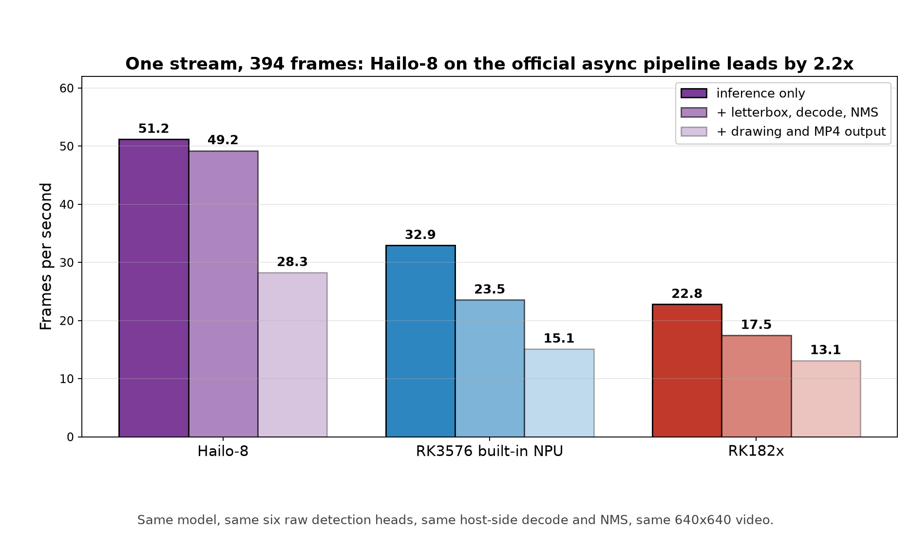
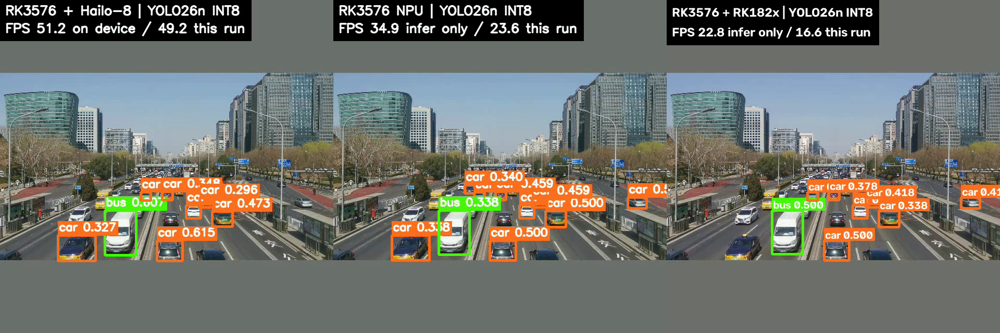
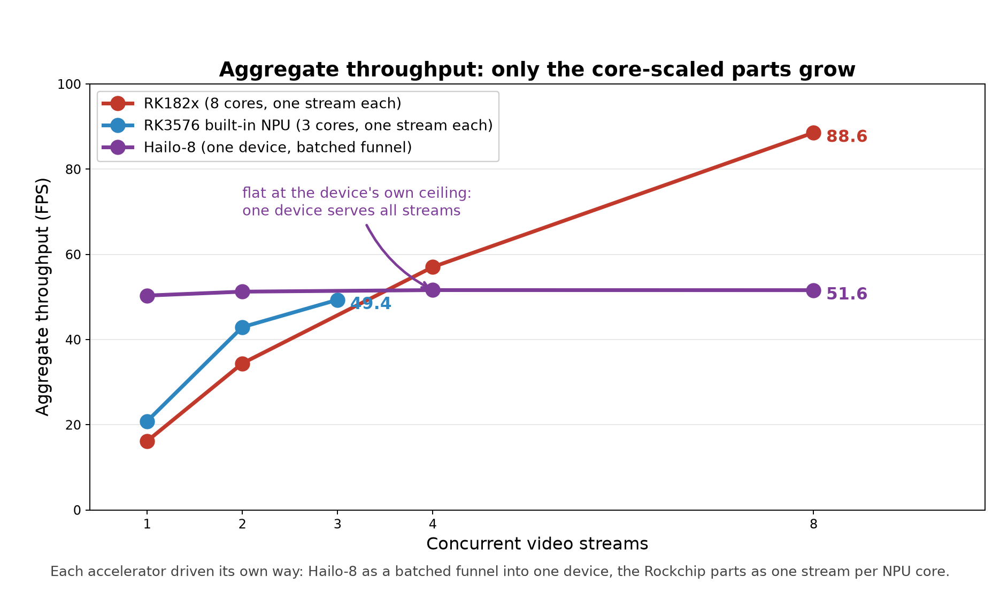

# Single-stream and multi-stream inference on an RK3576: built-in NPU vs two M.2 accelerators

The RK3576 has a 6 TOPS NPU on the die and one M.2 slot for an external accelerator. I ran the
**same YOLO26n** on three of them — the built-in NPU, an RK182x module and a Hailo-8 module —
first one stream at a time, then many streams at once, to see where each one belongs.

## Three architectures need three test methods

| Accelerator | How it goes parallel | Inference API used here |
|---|---|---|
| RK3576 built-in NPU | 2 NPU cores, one stream per core | rknn-toolkit-lite2 (synchronous) |
| RK182x (M.2) | 8 NPU cores, one stream per core | rknn3lite (synchronous, no async API) |
| Hailo-8 (M.2) | one device, no user-visible core split; internal pipeline | **InferModel.run_async, 4–8 frames in flight** |

So the Rockchip parts were driven **one stream per core**, while Hailo-8 was driven as
**N streams funnelled into one device and served asynchronously**. Both report the same metric:
**aggregate frames per second while N streams are being served**. Forcing Hailo-8 into the
Rockchip core model would have measured the API, not the silicon.

## Measurement conditions

- Model: `yolo26n`, 80 COCO classes, 640x640, INT8. All three graphs stop at the **same six raw
  one2one detection heads**, and decode/NMS run in **one shared host implementation**; the
  letterboxed input is byte-identical.
- Hailo-8 runs **Hailo's official prebuilt HEF** through **Hailo's recommended asynchronous
  pipeline** (`create_infer_model` -> `configure()` -> `run_async()`, the same pattern
  `hailortcli run` uses internally); RK182x uses **Rockchip's official quantization recipe**
  (w8a8 with w16a16 subgraphs); the RK3576 model was converted with the same graph boundary
  (rknn-toolkit2 2.3.2).
- Video: 3840x2160 source, 394 frames. There is no hardware decoder in this environment
  (software 4K decode costs 60.7 ms/frame), so a 640x640 derivative of the same clip was used
  for the accelerator comparison: 2.1 ms/frame.
- Multi-stream runs decode a video and run inference per stream; **drawing and video encoding are
  excluded** — that is host CPU work and is reported separately.

## One stream: Hailo-8 leads

| Accelerator | inference only | + letterbox, decode, NMS | + drawing and MP4 output |
|---|---:|---:|---:|
| Hailo-8 (async depth 4) | **51.2 FPS** | **49.2 FPS** | 28.3 FPS |
| RK3576 built-in NPU | 32.9 FPS | 23.5 FPS | 15.1 FPS |
| RK182x | 22.8 FPS | 17.5 FPS | 13.1 FPS |

Full 394-frame clip, identical pipeline. **Hailo-8's pipeline throughput is 2.1x the built-in
NPU's**, its device service rate of 51.2 FPS is 98% of the 52.5 FPS Hailo's own CLI reports for
this HEF, and its hardware latency is 13.9 ms per inference against roughly 30 ms and 44 ms for
the other two.

The decisive factor in that row is **asynchrony**. With the synchronous API (submit, wait, decode,
submit) the device sat idle while the host decoded and the same board, HEF and decode measured
26.0 FPS. Keeping four inferences in flight lifted it to 49.2 FPS: same silicon, different use of
the API. The old numbers are kept under `results/final_benchmark/_syncmethod/`. The two Rockchip
parts currently only have synchronous Python bindings, so their figures are bounded by those
bindings rather than by their silicon.

*Frame 200 of each annotated clip, left to right: Hailo-8, the RK3576 built-in NPU, RK182x. The
strip in the corner is drawn by the run itself - the accelerator's single-stream rate and the
rate that annotated pass sustained. The strip text on all three frames was verified pixel by
pixel with `common/check_osd_strip.py`.*

## Many streams: Hailo-8 serves all of them at its own ceiling, but does not grow

| Concurrent streams | Hailo-8 (async depth 8) | RK3576 built-in NPU | RK182x |
|---:|---:|---:|---:|
| 1 | 50.3 | 20.9 | 16.2 |
| 2 | 51.3 | 42.9 | 34.4 |
| 3 | - | 49.4 | - |
| 4 | 51.6 | - | 57.0 |
| **8** | **51.6** | - | **88.6** |

- **Hailo-8 is flat**: 1 stream or 8 streams, the total stays at 50-52 FPS and each stream gets
  1/N of it (6.5 FPS each at 8 streams). What changed with the async pipeline is *where* it is
  flat: at the device's own ceiling — the same 8-stream run with the host decode removed measures
  52.2 FPS. It is a fixed-throughput device: opened exclusively (Hailo's own CLI is refused a
  second process), no user-visible cores, and no growth with stream count.
- **The built-in NPU scales to its cores** (49.4 FPS) — now slightly *below* Hailo-8's 51.6.
- **RK182x scales linearly to 88.6 FPS across 8 cores**, 1.7x Hailo-8.

## What that means

| Use case | Choice | Why |
|---|---|---|
| One camera / one stream | **Hailo-8** | 49.2 vs 23.5 FPS, and the lowest single-frame latency at 13.9 ms |
| One stream without a module | built-in NPU | 23.5 FPS, free, no module |
| **Multi-camera, 4+ streams** | **RK182x** | 88.6 FPS at 8 streams; Hailo-8 caps at 51.6, the built-in NPU at 49.4 |

**RK182x's value is stream density** — one module does the work of more than three built-in NPU
cores; the cost is that each stream drops to 11.1 FPS at 8 streams, and the host has to feed all
eight. **Hailo-8's value is the single stream**: it drives its device to its full 51.2 FPS at the
lowest latency, and it keeps the work off the SoC's NPU.

To raise total throughput on the Hailo side, Hailo's answer is **more modules** (one stream per
module), not more streams per module — a different scaling model from the Rockchip parts.

## Notes

1. Single-stream figures are the last of several identical runs; each multi-stream point was
   measured once.
2. Multi-stream runs exclude drawing and encoding; eight annotated output videos would make the
   host CPU the bottleneck first (already visible on one stream: adding drawing and MP4 writing
   takes 49.2 FPS down to 28.3).
3. No hardware decoder here, so the 4K source tops out at 16.5 FPS; a real deployment should use
   the RK3576's VPU.
4. This board's PCIe link is **Gen2 x1** while the Hailo-8 module supports Gen3 x4, so Hailo's
   published 155 FPS is not reachable here — Hailo's own official HEF measures 52.5 FPS.
5. Hailo-8 runs on the official async pipeline while the two Rockchip parts run on their
   synchronous bindings (no async API is exposed in Python), so the "inference only" columns are
   not fully like-for-like: each is that platform's best currently available path.
6. The three annotated clips ship with the results
   (`results/final_benchmark/<device>/annotated.mp4`), together with each device's frame-200
   screenshot and its pixel-level strip check (`<device>/frame200.png`,
   `<device>/frame200_strip_check.json`). The RK182x clip was re-rendered from that
   run's recorded per-frame detections, because the module had already been swapped out of the
   slot; boxes and confidences are the run's own.
7. Every figure is generated from the raw JSON by `common/make_final_figures.py` and
   `common/make_osd_figure.py`; measurements are archived under `results/final_benchmark/`.